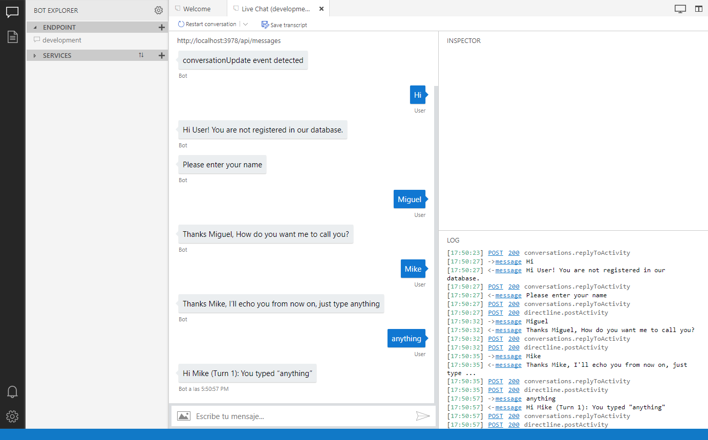
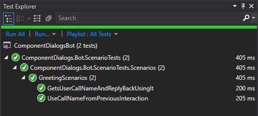
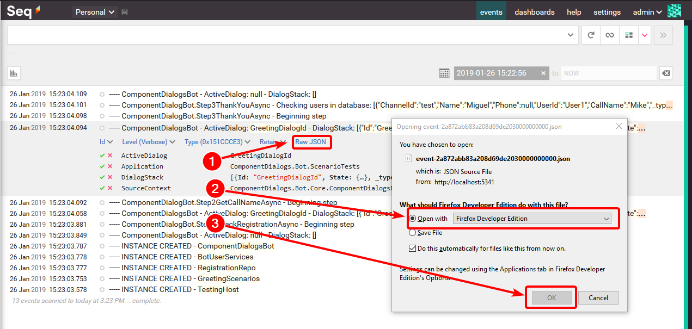
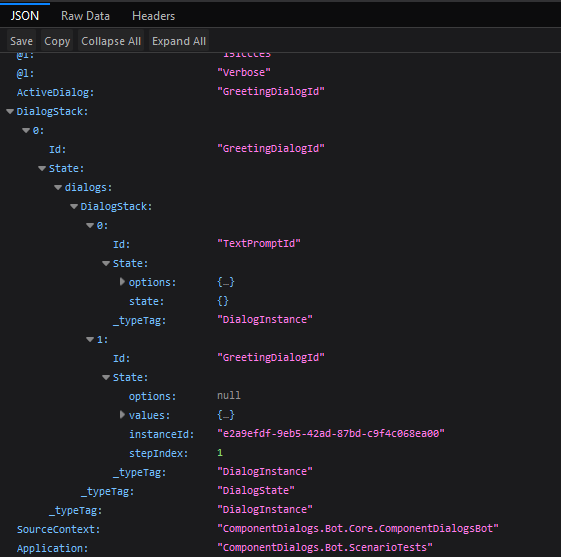
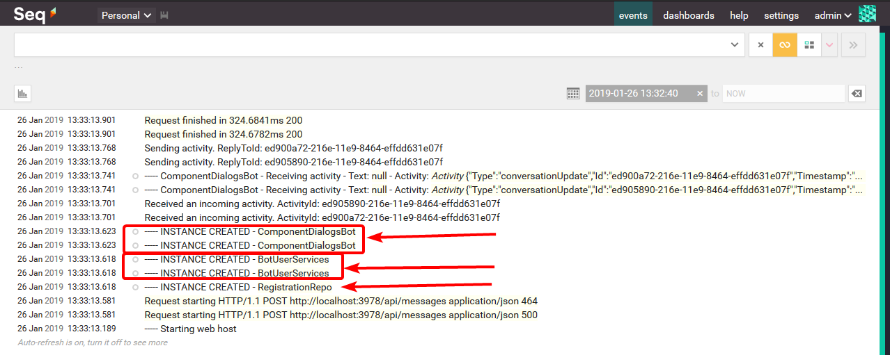
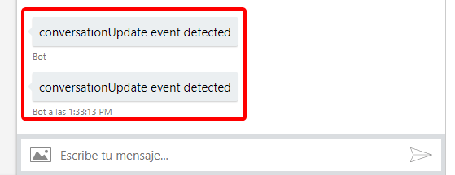
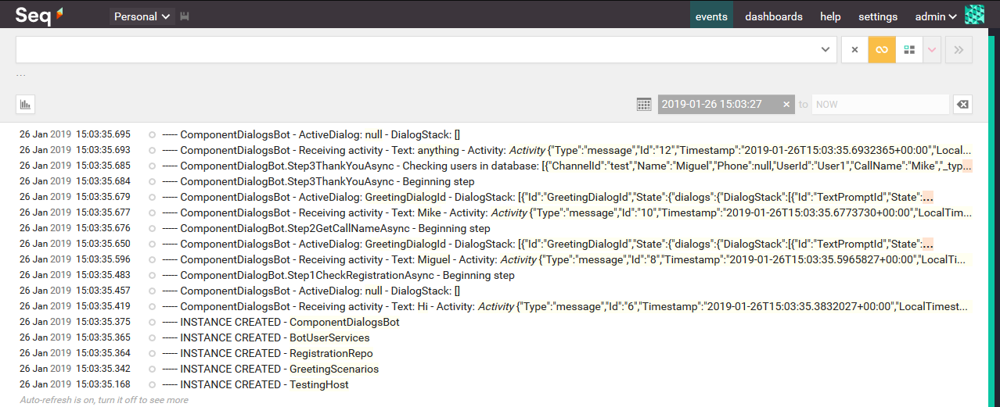

En este artículo exploraremos cómo usar los diálogos del Bot Builder v4 como componentes reutilizables, a través de algunos experimentos. Este es el primer artículo y hay, hasta ahora, otro más en proceso.

Cuando leí la documentación sobre la [librería de diálogos del Bot Builder v4](https://docs.microsoft.com/en-us/azure/bot-service/bot-builder-concept-dialog?view=azure-bot-service-4.0), en especial la sección sobre [Component dialogs](https://docs.microsoft.com/en-us/azure/bot-service/bot-builder-concept-dialog?view=azure-bot-service-4.0#component-dialog), me llamó la atención porque pensé que facilitarían su reutilización entre proyectos.

Sin embargo al ver los tutoriales y otros ejemplos que encontré, me quedé un poco decepcionado porque no vi que se usara inyección de dependencias (**DI - Dependency Injection**), sino que los diálogos se instanciaban de la peor forma, con `new` y todo lo que ello implica.

Al final creo que encontré una forma interesante de manejar diálogos, sobre la que me gustaría conocer tus comentarios, al final de artículo.

Voy a partir de un bot que ya funciona, con un par de escenarios de prueba, para ir refactorizándolo hasta conseguir algo que me parezca razonable como componente. No voy a pasar por todo el proceso de desarrollo, pero está basado en gran medida en el [artículo anterior](../explorando-bot-builder-v4-tdd-aspnet-core-2.1/), aunque encontrarás algunas diferencias como resultado de un mejor conocimiento del Bot Builder.

En líneas generales el artículo contiene lo siguiente:

1. Funcionamiento general del bot base, que refactorizaremos para aproximarnos al modelo de componentes que buscamos.
2. Preparación del entorno para incluir *logging* y *dependency injection* (DI) en las pruebas.
3. Refactorización del bot inicial para acercarnos al manejo de diálogos como componentes.
4. Exploración los logs
5. Resumen final

## 1 - Funcionamiento del bot

En líneas generales, el bot funcionará así: al comenzar la interacción, el bot buscará al usuario en un registro (por el `UserName` del canal, el Bot Emulator en este caso), para dirigirse a él/ella según haya indicado como preferencia. Si no existe, entonces le pedirá darse de alta, para tener la información necesaria.

Una interacción típica sería así:



Podemos ver que se trata de la misma interacción base del [EchoBot](https://github.com/Microsoft/BotBuilder-Samples/tree/master/samples/csharp_dotnetcore/02.b.echo-with-counter), pero con unas interacciones previas, donde verificamos si el usuario existe en el registro y, en caso contrario, le damos de alta.

A continuación mostramos los dos escenarios de prueba. En este primero, damos de alta a un usuario que no existe y luego verificamos que quede registrado en el servicio.

```cs
[Fact]
public async Task GetsUserCallNameAndReplyBackUsingIt()
{
    // Arrange -----------------
    var services = GetService<IBotUserServices>();

    var testFlow = CreateBotTestFlow<ComponentDialogsBot>()
        .Send("Hi")
        .AssertReply("Hi User1! You are not registered in our database.")
        .AssertReply("Please enter your name")
        .Send("Miguel")
        .AssertReply("Thanks Miguel, How do you want me to call you?")
        .Send("Mike")
        .AssertReply("Thanks Mike, I'll echo you from now on, just type anything")
        .Send("anything")
        .AssertReply("Hi Mike (Turn 1): You typed \"anything\"");

    // Act ---------------------
    await testFlow.StartTestAsync();

    // Assert ------------------
    var users = await services.GetListAsync();

    var expectedUsr = new BotUser
    {
        ChannelId = "test",
        UserId = "User1",
        Name = "Miguel",
        CallName = "Mike"
    };

    users.Should().BeEquivalentTo(new[] { expectedUsr });
}
```

Y en este segundo escenario agregamos primero un usuario al registro y verificamos que se utilicen esos datos:

```cs
[Fact]
public async Task UseCallNameFromPreviousInteraction()
{
    // Arrange -----------------
    var repo = GetService<RegistrationRepo>();

    repo.Users.Add(new BotUser
    {
        ChannelId = "test",
        UserId = "User1",
        Name = "Eduard",
        CallName = "Ed"
    });

    var testFlow = CreateBotTestFlow<ComponentDialogsBot>()
        .Send("Hi")
        .AssertReply("Hi Ed, nice to talk to you again!")
        .Send("Howdy")
        .AssertReply("Hi Ed (Turn 1): You typed \"Howdy\"");

    // Act ---------------------
    await testFlow.StartTestAsync();

    // Assert ------------------
}
```

Nos aseguramos que estos escenarios se ejecuten correctamente y guardamos el proyecto en el repositorio, con el tag `begin`:



Puedes ver los detalles de preparación de las pruebas en el [artículo anterior](../explorando-bot-builder-v4-tdd-aspnet-core-2.1/).

## 2 - Logging y Dependency Injection

En este artículo también vamos a ver un par de características interesantes, como son el uso de **Logging** y **Dependency Injection** (DI) en las clases de prueba.

Estas dos características están incluidas por default en ASP.NET Core y no tenemos que preocuparnos mucho por ellas en las aplicaciones, pero no hay mucha información sobre cómo utilizarlas en las pruebas. Sin embargo, veremos que es muy sencillo hacerlo aunque estemos trabajando fuera de ASP.NET Core, como en el caso de las pruebas, solo hay que tener en cuenta algunos detalles importantes que veremos en su momento.

Para manejar la DI usaremos la librería estándar de .NET Core.

### 2.1 - Logging

Para el logging utilizaremos la librería [Serilog](https://serilog.net/) para manejar [logging estructurado](https://nblumhardt.com/2016/06/structured-logging-concepts-in-net-series-1/) y veremos que éste representa muchas ventajas respecto al logging tradicional, de texto simple.

Además usaremos el visor de logs [Seq](https://getseq.net/), que es el compañero perfecto de Serilog, de hecho desarrollados ambos por [Nicholas Blumhardt](https://nblumhardt.com/).

Serilog es un proyecto [open source en GitHub](https://github.com/serilog/serilog) y aunque Seq no lo sea, sí es posible [usarlo gratis en desarrollo y en proyectos pequeños](https://getseq.net/Pricing), por lo que lo utilizaremos en nuestras pruebas.

Los detalles de la preparación del logging y DI se quedarán para un artículo futuro, pero sí haremos énfasis en los puntos más importantes.

#### 2.1.1 - Preparación del entorno para logging

El punto principal de configuración del entorno se refiere a la instalación de Seq, para la que tenemos dos opciones:

1. Instalarlo localmente en la máquina de desarrollo o

2. Instalarlo en un contenedor Docker

En general, si tu máquina tiene capacidad suficiente, recomiendo la segunda opción. En este caso solo es necesario:

1. Instalar Docker y configurarlo para trabajar con contenedores Linux y

2. Crear el batch siguiente, para instalar y ejecutar Seq desde Docker en una sola operación:

```cmd
docker start seq
if errorlevel 1 docker run --name seq -d -e ACCEPT_EULA=Y -p 5341:80 datalust/seq:latest 
rem wait for 5 seconds
ping -n 5 127.0.0.1 > nul
start http://localhost:5341/#/events?deletionEnabled
```

Para los detalles de la instalación local en la máquina de desarrollo, puedes consultar la [documentación de Seq](https://docs.getseq.net/docs/getting-started).

#### 2.1.2 - Recomendación para consultar las trazas

Me ha resultado interesante la combinación de Seq con [Firefox Developer Edition](https://www.mozilla.org/firefox/developer/) porque hace muy sencillo explorar las trazas en detalle, como puedes ver aquí:



Gracias al visor JSON integrado:




### 2.2 - Dependency Injection

Vamos a explorar muy rápidamente los aspectos más importantes de la configuración de las pruebas con [xUnit](https://xunit.github.io/) para aplicar DI.

En este caso los componentes más importantes son:

- `TestingHost` - La clase que prepara el entorno de logging y DI para las pruebas.
- `GreetingScenarios` - La clase con los escenarios de pruebas.

#### 2.2.1 - El host de pruebas `TestingHost`

La clase `TestingHost` cubre las funciones de `Program` y `Startup` en ASP.NET Core, tal como vemos en el siguiente código:

```cs
public class TestingHost : IDisposable
{
    private static readonly string ApplicationName = typeof(TestingHost).Namespace;

    public TestingHost()
    {
        // Configuration setup
        Configuration = new ConfigurationBuilder()
            .SetBasePath(Directory.GetCurrentDirectory())
            .AddJsonFile("appsettings.json", optional: false, reloadOnChange: true)
            .AddEnvironmentVariables()
            .Build();

        // Logging setup
        Log.Logger = new LoggerConfiguration()
            .MinimumLevel.Verbose()
            .Enrich.WithProperty("Application", ApplicationName)
            .Enrich.FromLogContext()
            .WriteTo.Console()
            .WriteTo.Seq("http://localhost:5341")
            .WriteTo.File(
                $@"D:\home\LogFiles\{ApplicationName}-.log",
                rollingInterval: RollingInterval.Day,
                retainedFileCountLimit: 15,
                shared: true,
                flushToDiskInterval: TimeSpan.FromSeconds(1))
            .CreateLogger();

        // Dependency injection setup
        var services = new ServiceCollection();

        // General infrastructure services configuration
        services.AddSingleton<IConfiguration>(sp => Configuration);
        services.AddSingleton(new LoggerFactory().AddSerilog());
        services.AddLogging();

        // Bot infrastructure services configuration
        services.AddScoped<IStorage, MemoryStorage>();
        services.AddScoped<ConversationState>();
        services.AddScoped<ComponentDialogsBotAccessors>(sp =>
        {
            var conversationState = sp.GetRequiredService<ConversationState>();

            // Create the custom state accessor.
            // State accessors enable other components to read and write individual properties of state.
            return new ComponentDialogsBotAccessors(conversationState)
            {
                CounterState = conversationState.CreateProperty<CounterState>(ComponentDialogsBotAccessors.CounterStateName),
                DialogState = conversationState.CreateProperty<DialogState>(ComponentDialogsBotAccessors.DialogStateName),
                GreetingState = conversationState.CreateProperty<GreetingState>(ComponentDialogsBotAccessors.GreetingStateName),
            };
        });

        // Bot service configuration
        services.AddScoped<ComponentDialogsBot>();

        // Application services configuration
        services.AddScoped<RegistrationRepo>();
        services.AddScoped<IBotUserServices, BotUserServices>();

        RootScope = services.BuildServiceProvider().CreateScope();

        Log.Verbose("----- INSTANCE CREATED - {ClassName}", GetType().Name);
    }

    public IConfigurationRoot Configuration { get; }

    public IServiceScope RootScope { get; }

    public IServiceScope CreateScope()
    {
        return RootScope.ServiceProvider.CreateScope();
    }

    #region IDisposable Support
    .../...
}
```

En un momento veremos cómo encaja esta clase en la ejecución de las pruebas, por ahora solo destacaremos que, en líneas generales, está tomada del `Startup` del EchoBot. Sin embargo, los servicios `IStorage`, `ConversationState`, `ComponnentDialogsBotAccessor` y `ComponentDialogsBot` están configurados como `Scoped` en vez de como `Singleton`, para asegurar que al comenzar cada escenario de pruebas todas las clases de estado tienen una condición inicial "limpia".

Si las configuráramos como `Singleton` entonces habría interferencias entre los casos de prueba.

#### 2.2.2 - La clase de pruebas `GreetingScenarios`

Esta es la clase que contiene los escenarios de prueba. Esta clase probablemente tendría sentido manejarla como una base de la que hereden las clases de prueba de escenarios.


public class GreetingScenarios : IClassFixture<TestingHost>, IDisposable
{
    private readonly ILogger<GreetingScenarios> _logger;
    private readonly IServiceScope _testingScope;

    public GreetingScenarios(TestingHost testingHost)
    {
        _testingScope = testingHost?.CreateScope() ?? throw new ArgumentNullException(nameof(testingHost));
        _logger = _testingScope.ServiceProvider.GetRequiredService<ILogger<GreetingScenarios>>();
        _logger.LogTrace("----- INSTANCE CREATED - {ClassName}", GetType().Name);
    }

    private TestFlow CreateBotTestFlow<TBot>()
        where TBot : IBot
    {
        var conversationState = GetService<ConversationState>();
        var bot = GetService<TBot>();

        var adapter = new TestAdapter().Use(new AutoSaveStateMiddleware(conversationState));

        adapter.OnTurnError = async (context, exception) =>
        {
            _logger.LogError(exception, "----- BOT ERROR - Activity: {@Activity}", context.Activity);
            await context.SendActivityAsync($"ERROR: {exception.Message}");
        };

        return new TestFlow(adapter, bot.OnTurnAsync);
    }

    private T GetService<T>()
    {
        return _testingScope.ServiceProvider.GetRequiredService<T>();
    }

    #region IDisposable Support
    .../...
}


Los aspectos a destacar aquí son:

- **Línea 1** - La clase está identificada con la interfaz marcadora `IClassFixture<TStartup>` de **xUnit**, lo que hace que **xUnit** cree una instancia de `TStartup` antes de comenzar todas las pruebas y la inyecte en cada instancia de `GreetingScenarios`

- Es importante estar conscientes de que **xUnit** crea una instancia de `GreetingScenarios` para ejecutar cada escenario de prueba.

- **Línea 8** - En el constructor se crea un `_testingScope` que define el ámbito de creación de las instancias `scoped` por inyección de dependencias.

- **Línea 30** - El método `GetService<T>` crea las instancias por DI dentro del `_testingScope`.

- **Línea 35** - Como `GreetingScenarios` implementa `IDisposable`, **xUnit** se encarga de ejecutar el `.Dispose()` al terminar cada escenario de prueba.

En resumen, toda la estructura anterior es funcionalmente equivalente este fragmento de código, que tendríamos que repetir en cada caso de pruebas y que te debe resultar muy conocido:

```cs
using (var scope = testingHost.CreateScope())
{
    // Local function to make it easier to instatiate services
    TService GetService<TService> => _testingScope.ServiceProvider.GetRequiredService<TService>();

    var service = GetService<TService>();
    .../...
}
```

## 3 - Refactorización

Ahora comenzaremos a refactorizar varios elementos del código hasta conseguir, o al menos acercarnos, lo que buscamos.

**NOTA IMPORTANTE**: Las refactorizaciones que muestro aquí han resultado adecuadas para los casos que he tenido que manejar hasta ahora, pero es posible que haya otros donde no sean las más convenientes. Así que es importante considerarlas solo como experimentos y, por lo tanto, no puedo asegurar que sean adecuadas para cada caso en particular, en consecuencia, debes realizar las pruebas necesarias para asegurar que funcionen para ti.

Con esta aclaratoria en mente, comenzamos entonces. El punto de partida en el repositorio está identificado con el tag `begin`.

A continuación realizaremos las siguientes refactorizaciones:

1. Simplificar la configuración de `ComponentDialogsBotAccessors` en `Startup`.
2. Generalizar `ComponentDialogsBotAccessors`.
3. Extraer la primera versión de `GreetingDialog` como componente.

### 3.1 - Configurando `ComponentDialogsBotAccessors`

Me parece que el uso de la clase tipo `accessors` facilita en buena medida el manejo del estado del bot, pero también creo que, en los ejemplos que he visto hasta ahora, se manejan demasiados detalles internos que se puede abstraer, así que comenzaremos por aquí.

En primer aspecto se refiere al registro en el contenedor de DI (en `Startup.ConfigureServices`):

```cs
services.AddScoped<ComponentDialogsBotAccessors>(sp =>
{
    var conversationState = sp.GetRequiredService<ConversationState>();

    // Create the custom state accessor.
    // State accessors enable other components to read and write individual properties of state.
    return new ComponentDialogsBotAccessors(conversationState)
    {
        CounterState = conversationState.CreateProperty<CounterState>(ComponentDialogsBotAccessors.CounterStateName),
        DialogState = conversationState.CreateProperty<DialogState>(ComponentDialogsBotAccessors.DialogStateName),
        GreetingState = conversationState.CreateProperty<GreetingState>(ComponentDialogsBotAccessors.GreetingStateName),
    };
});
```

Si inicializamos todos los *accessors*  en el constructor de la clase, que al final es lo que se hace aquí, el código anterior se puede simplificar a una sola línea, para llegar a esto:

```cs
services.AddScoped<ComponentDialogsBotAccessors>();
```

También podemos hacer lo anterior porque `ConversationState` ya está registrado en el contenedor de DI y entonces no necesitamos una factoría.

Además, luego podemos ocultar las propiedades `CourterStateName`, `DialogStateName` y `GreetingStateName` de `ComponentDialogsBotAccessors`, porque ya no son necesarias fuera de la clase.

Más adelante vamos a mostrar como queda `ComponentDialogsBotAccessors`, porque todavía vamos a hacer más cambios.

Ahora tenemos que modificar el `Startup` del bot para manejar los cambios anteriores. Esto es un poco más elaborado pero, en líneas generales, se resuelve de esta forma:


public class Startup
{
    .../...
    private IServiceProvider _appServices;
    .../...

    public void Configure(
        IApplicationBuilder app,
        ILoggerFactory loggerFactory,
        IServiceProvider appServices)
    {
        _appServices = appServices;
        .../...
    }

    public void ConfigureServices(IServiceCollection services)
    {
        services.AddSingleton<IStorage, MemoryStorage>();
        services.AddSingleton<ConversationState>();
        services.AddSingleton<ComponentDialogsBotAccessors>();

        services.AddBot<ComponentDialogsBot>(options =>
        {
            .../...
            var conversationState = _appServices.GetService<ConversationState>();

            options.State.Add(conversationState);
            options.Middleware.Add(new AutoSaveStateMiddleware(conversationState));
        });

        // Create and register state accessors.
        // Accessors created here are passed into the IBot-derived class on every turn.
        services.AddSingleton<ComponentDialogsBotAccessors>();
    }
}


Donde vale la pena resaltar:

- En vez de crear el `IStorage` y el `ConversationState` dentro de la factoría del Bot, se registran en el contenedor de DI (líneas 18 y 19).

- Se elimina la factoría del `ComponentDialogsBotAccessors` y se reemplaza por un registro simple (línea 20).

- Para poder usar DI dentro de la factoría del bot, se pide un `IServiceProvider` en el `Configure` (línea 10) para...

- Acceder a los servicios de DI en la factoría del bot (Líneas 12, 4 y 25).

- **NOTA:** Revisando el artículo me di cuenta que había eliminado por error a línea 27, pero eso no pareció afectar el funcionamiento del bot. Esto suena como un punto interesante a explorar en próximos artículos 😉.

Si tienes dudas sobre cómo o por qué funciona el acceso a los servicios en la línea 25, te recomiendo que pongas trazas con el logger en `Configure`, `ConfigureServices` y en la factoría, para entender mejor algunos detalles del arranque de la aplicación.

Puedes ver el detalle de todos estos cambios en el tag `refactor-1` del repositorio.

### 3.2 - Simplificando `ComponentDialogsBotAccessors`

El accessor es una forma de abstraer el manejo de los objetos de estado, pero tal como está en los ejemplos del Bot Builder, requiere bastante código repetitivo que también se puede refactorizar.

Vamos a empezar con dos métodos que se utilizan con frecuencia, el primero para obtener el valor del estado:

```cs
public async Task<CounterState> GetCounterStateAsync(
    ITurnContext context, 
    CancellationToken cancellationToken)
{
    return await CounterState.GetAsync(context, () => new CounterState(), cancellationToken);
}
```

Y el segundo para cambiarlo, donde usamos un `Action`, para tener una solución genérica:

```cs
public async Task<CounterState> SetCounterStateAsync(
    ITurnContext context, 
    Action<CounterState> updateAction, 
    CancellationToken cancellationToken)
{
    var state = await GetCounterStateAsync(context, cancellationToken);

    updateAction.Invoke(state);

    await CounterState.SetAsync(context, state, cancellationToken);

    return state;
}
```

En principio deberían existir los dos métodos para cada objeto de estado que se utilice, pero esto es fácil manejarlo con genéricos. De esta forma, la clase `ComponentDialogsBotAccessors` resulta en lo siguiente:


public class ComponentDialogsBotAccessors
{
    private readonly Dictionary<string, object> _stateAccessors = new Dictionary<string, object>();

    public ComponentDialogsBotAccessors(
        ConversationState conversationState)
    {
        ConversationState = conversationState ?? throw new ArgumentNullException(nameof(conversationState));

        DialogState = GetAccessor<DialogState>();
    }

    public ConversationState ConversationState { get; }

    public IStatePropertyAccessor<DialogState> DialogState { get; }

    public async Task<TState> GetAsync<TState>(ITurnContext context, CancellationToken cancellationToken)
        where TState : new()
    {
        var accessor = GetAccessor<TState>();

        return await accessor.GetAsync(context, () => new TState(), cancellationToken);
    }

    public async Task<TState> SetAsync<TState>(ITurnContext context, Action<TState> updateAction, CancellationToken cancellationToken)
        where TState : new()
    {
        var accessor = GetAccessor<TState>();
        var state = await accessor.GetAsync(context, () => new TState(), cancellationToken);

        updateAction.Invoke(state);

        await accessor.SetAsync(context, state, cancellationToken);

        return state;
    }

    private IStatePropertyAccessor<TState> GetAccessor<TState>()
    {
        var accessorKey = $"{nameof(ComponentDialogsBotAccessors)}.{typeof(TState).Name}";
        IStatePropertyAccessor<TState> accessor = null;

        if (_stateAccessors.ContainsKey(accessorKey))
        {
            accessor = _stateAccessors[accessorKey] as IStatePropertyAccessor<TState>;
        }
        else
        {
            accessor = ConversationState.CreateProperty<TState>(accessorKey);
            _stateAccessors.Add(accessorKey, accessor);
        }

        return accessor;
    }
}


Y funciona de la siguiente manera:

- Se utiliza un diccionario (línea 3), para manejar cualquier cantidad de accessors.

- Solo se mantiene el accessor `DialogState` como propiedad específica (línea 10) porque es necesaria para trabajar con los diálogos.

- los métodos `GetAsync<TState>` (línea 17) y `SetAsync<TState>` (línea 25) son básicamente el uso estándar de los accessors, así que creo que no requieren mayor explicación. Excepto quizás por el hecho de que se utiliza un `Action<TState>` (línea 31) para poder hacer cualquier cosa con el objeto de estado.

- Más interesante es `GetAccessor<TState>` (línea 38), que normaliza la clave de búsqueda en el diccionario (línea 40), para devolver el accessor si ya está registrado (línea 45) o crearlo y registrarlo si no (líneas 49 y 50).

Con esto terminamos con un accessor completamente genérico, así que habría que cambiarle el nombre y agregar otros métodos, como `DeleteAsync`, pero lo dejamos así por ahora.

Este nuevo accessor también ayuda a simplificar el uso, por ejemplo, podemos pasar de esto:

```cs
// Get the conversation state from the turn context.
var state = await _accessors.CounterState.GetAsync(turnContext, () => new CounterState());

// Bump the turn count for this conversation.
state.TurnCount++;

// Update the property using the accessor.
await _accessors.CounterState.SetAsync(turnContext, state);
```

a esto otro:

```cs
// Set the conversation state from the turn context.
var state = await _accessors.SetAsync<CounterState>(turnContext, s => s.TurnCount++, cancellationToken);
```

Puedes ver el detalle de todos estos cambios en el tag `refactor-2` del repositorio.

### 3.3 - "Componentizando" `GreetingDialog`

Ahora vamos a refactorizar el `GreetingDialog` para convertirlo en un componente, es decir, en una clase aparte.

No vamos a entrar en todos los detalles, pero sí vamos a ver los cambios en los constructores.

En el caso de `ComponentDialogsBot`, comenzamos con ese fragmento de código:


public class ComponentDialogsBot : IBot
{
    public const string GreetingDialogId = nameof(GreetingDialogId);
    public const string TextPromptId = nameof(TextPromptId);
    .../...
    public ComponentDialogsBot(
        ComponentDialogsBotAccessors accessors,
        ILogger<ComponentDialogsBot> logger,
        IBotUserServices botUserServices)
    {
        _logger = logger ?? throw new System.ArgumentNullException(nameof(logger));
        _accessors = accessors ?? throw new System.ArgumentNullException(nameof(accessors));
        _botUserServices = botUserServices ?? throw new System.ArgumentNullException(nameof(botUserServices));

        Dialogs = new DialogSet(_accessors.DialogState)
            .Add(new TextPrompt(TextPromptId))
            .Add(new WaterfallDialog(GreetingDialogId)
                .AddStep(Step1CheckRegistrationAsync)
                .AddStep(Step2GetCallNameAsync)
                .AddStep(Step3ThankYouAsync));

        _logger.LogTrace("----- INSTANCE CREATED - {ClassName}", GetType().Name);
    }
    .../...
}


Aquí vemos como:

- Se inyectan los servicios de usuarios (línea 11)
- Se crea la estructura del diálogo que vamos a usar (líneas 17-22)

En esta caso vamos a sacar toda la definición de la estructura del diálogo a la nueva clase `GreetingDialog`, junto con todos los métodos de soporte. También vamos a cambiar la inyección del servicio de usuarios por la inyección del diálogo, con lo que el constructor ahora queda así:


public class ComponentDialogsBot : IBot
{
    .../...
    public ComponentDialogsBot(
        ILogger<ComponentDialogsBot> logger,
        ComponentDialogsBotAccessors accessors,
        GreetingDialog greetingDialog)
    {
        _logger = logger ?? throw new System.ArgumentNullException(nameof(logger));
        _accessors = accessors ?? throw new System.ArgumentNullException(nameof(accessors));
        if (greetingDialog == null) throw new System.ArgumentNullException(nameof(greetingDialog));

        Dialogs = new DialogSet(_accessors.DialogState)
            .Add(greetingDialog);

        _logger.LogTrace("----- INSTANCE CREATED - {ClassName}", GetType().Name);
    }
    .../...
}


La diferencia importante aquí, respecto a la [documentación del Bot Builder](https://docs.microsoft.com/en-us/azure/bot-service/bot-builder-compositcontrol?view=azure-bot-service-4.0&tabs=csharp#add-the-component-dialogs-to-the-bot) (en Enero/2019), es que en el ejemplo se instancian los diálogos en el constructor, en vez de inyectarlos:


.../...
// Define the steps of the main dialog.
WaterfallStep[] steps = new WaterfallStep[]
{
    MenuStepAsync,
    HandleChoiceAsync,
    LoopBackAsync,
};

// Create our bot's dialog set, adding a main dialog and the three component dialogs.
_dialogs = new DialogSet(_accessors.DialogStateAccessor)
    .Add(new WaterfallDialog(MainDialogId, steps))
    .Add(new CheckInDialog(CheckInDialogId))
    .Add(new ReserveTableDialog(TableDialogId))
    .Add(new SetAlarmDialog(AlarmDialogId));
.../...


Por otro lado, el constructor de `GreetingDialog` queda así:


public class GreetingDialog : ComponentDialog
{
    public const string GreetingDialogId = nameof(GreetingDialogId);
    public const string TextPromptId = nameof(TextPromptId);
    .../...
    public GreetingDialog(
        ILogger<GreetingDialog> logger,
        ComponentDialogsBotAccessors accessors,
        IBotUserServices botUserServices)
        : base(GreetingDialogId)
    {
        _logger = logger ?? throw new ArgumentNullException(nameof(logger));
        _accessors = accessors ?? throw new ArgumentNullException(nameof(accessors));
        _botUserServices = botUserServices ?? throw new ArgumentNullException(nameof(botUserServices));

        InitialDialogId = Id;

        AddDialog(new WaterfallDialog(GreetingDialogId)
            .AddStep(Step1CheckRegistrationAsync)
            .AddStep(Step2GetCallNameAsync)
            .AddStep(Step3ThankYouAsync));

        AddDialog(new TextPrompt(TextPromptId));
    }
    .../...
}


Lo más interesante de trabajar con DI es que basta con "pedir" un servicio en el constructor (línea 9) para tenerlo disponible en el diálogo. Esto es, desde luego, mucho más cómodo que si tenemos que instanciar los objetos con `new`.

Y ya que estamos trabajando diálogos con DI, podemos construir de esta forma todo el árbol de diálogos que necesitemos.

Finalmente, por supuesto, solo nos falta registrar el diálogo en el contenedor de DI en `Startup.ConfigureServices()`:

```
services.AddScoped<GreetingDialog>();
```

Todavía faltan por hacer algunas refactorizaciones más, pero las dejaremos para el próximo artículo, para no extendernos mucho más.

Como en los pasos anteriores, puedes ver los detalles de todos los cambios relacionados en el tag `refactor-3` del repositorio.

## 4 - Explorando los logs

Ya que instalamos Seq y tenemos logging tanto para la aplicación como para las pruebas, vamos a explorar un poco.

### 4.1 - Logs generados por el Bot Emulator

Si no lo hemos hecho antes, arrancamos nuestro contenedor de Seq y luego arrancamos la aplicación. Después nos conectamos con el bot emulator y echamos un vistazo:



Aquí vale la pena destacar lo siguiente:

- `RegistrationRepo` se instancia solo una vez, que es lo esperado porque está registrado como `Singleton`.
- El diálogo y los servicios de usuarios se instancian dos veces cada uno. Una vez por cada actividad (request) de tipo `ConversationUpdate` que envía el emulador:



Tal como esperábamos, cada turno de la interacción se ejecuta en el contexto de un request porque, al final, un bot es una aplicación API REST.

Algo que llama la atención, es que se crean instancias del diálogo y de los servicios en un momento en que no es necesario. Y uno de los aspectos interesantes de esto, es que da material para otro artículo 😉.

### 4.2 - Logs generados por las pruebas

Ya para terminar, vamos a ver cómo se ven las trazas durante una prueba, en este caso del escenario `GetsUserCallNameAndReplyBackUsingIt` que presentamos previamente.



En este caso, lo que más llama la atención, es que solo se crea una instancia de las clases relacionadas, a diferencia de lo que vimos en el caso anterior.

Es muy importante tener esto en cuenta, porque una prueba realizada de esta forma puede funcionar bien, pero fallar cuando se ejecute en producción. Esto puede ocurrir si en la lógica se utilizan variables de la clase para pasar información entre dos pasos que, en realidad, se ejecuten en requests diferentes en el bot.

Es precisamente por esto, que se deben utilizar los accessors para guardar las variables de estado de la lógica del bot, porque éstas sí se mantienen entre requests, porque se guardan en el estado de la conversación.

Con esto damos por terminado el contenido principal del artículo y, como hasta ahora, puedes ver los detalles de los (pocos) cambios en el tag `refactor-4` del repositorio.

## 5 - Resumen

En este artículo realizamos algunos experimentos con los `ComponentDialogs` y descubrimos que:

1. Se puede simplificar significativamente el código de configuración del bot, con unos pequeños cambios y aprovechando las facilidades del contenedor estándar de inyección de dependencias de .NET Core.

2. Se puede crear una clase *accessor* genérica para manejar cualquier tipo de objeto de estado del bot.

3. Es posible usar la inyección de dependencias estándar de .NET Core para inyectar `ComponentDialogs` en el bot.

4. Cuando se instancia el bot, se instancia también todo el árbol de diálogos y los servicios utilizados, lo que puede representar un consumo significativo de recursos que, en la gran mayoría de los casos, no se utilizan.

5. Las pruebas de bots realizadas con la infraestructura de pruebas del Bot Builder v4, no reproducen completamente el entorno del funcionamiento habitual del bot.

Espero que todo esto te resulte útil y te invito a dejar tus comentarios más abajo.
