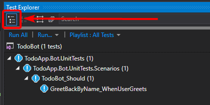
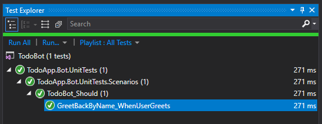
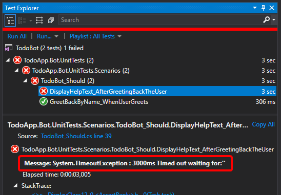
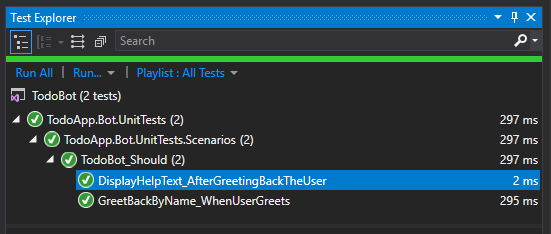
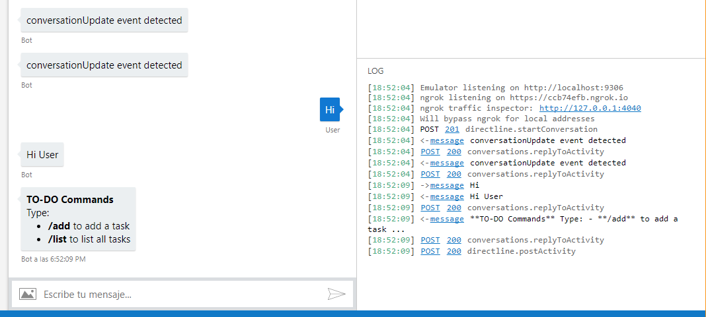
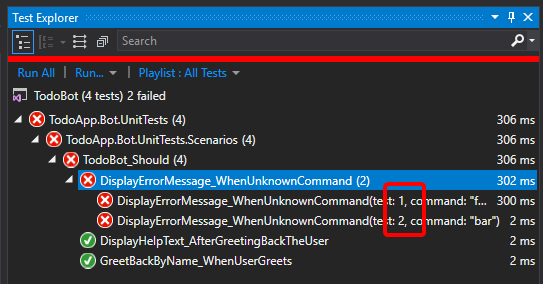
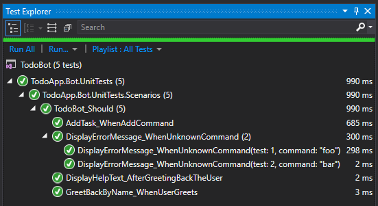

En este artículo/tutorial, vamos a desarrollar una pequeña aplicación tipo TO-DO list, muy sencilla, en ASP\.NET Core 2.1 con el [Bot Builder SDK v4](https://github.com/Microsoft/botbuilder-dotnet), aplicando el proceso de desarrollo TDD (Test Driven Development).

Vamos a usar un enfoque TDD de "alto nivel", más cercano a las pruebas de aceptación que a las pruebas unitarias que se suelen usar de ejemplo, con lo que tendremos otra visión de las pruebas. Por otro lado tampoco empezamos desde cero, sino desde un proyecto inicial que funciona, al que agregaremos las pruebas.

Este enfoque a lo mejor podría parecer poco adecuado para TDD, pero me parece que así se logra un buen balance entre lo práctico y lo efectivo.

Puede conseguir el código fuente de la aplicación en [GitHub](https://github.com/turing-challenge/TodoBot).

## 1 - Introducción

La versión 4 del SDK Bot Builder, se reescribió por completo, aprovechando toda la experiencia de las versiones anteriores y tiene algunos cambios importantes de arquitectura, que están muy bien recopilados y explicados en el blog post [Bot Framework V4: What I learnt in 4 days in July 2018](https://blogs.msdn.microsoft.com/martinkearn/2018/07/17/bot-framework-v4-what-i-learnt-in-4-days-in-july-2018/) de [Martin Kearn](https://blogs.msdn.microsoft.com/martinkearn/), donde se pueden revisar en detalle con links a la documentación relevante.

La aplicación que vamos a desarrollar se puede usar luego para explorar paso a paso la nueva funcionalidad presentada en ese post.

Vamos a desarrollar la aplicación partiendo del [tutorial del EchoBot](https://docs.microsoft.com/azure/bot-service/dotnet/bot-builder-dotnet-sdk-quickstart?view=azure-bot-service-4.0).

## 2 - Versiones utilizadas

- Visual Studio 2017 v15.9.1
- Microsoft.Bot.Builder.Core (4.1.5)
- Microsoft.Bot.Builder.Core.Extensions (4.1.5)
- Microsoft.Bot.Builder.Integration.AspNet.Core (4.1.5)
- FluentAssertions (5.5.1)
- Moq (4.10.0)
- xunit (2.4.1)
- xunit.runner.visualstudio (2.4.1)

## 3 - Vista general de la aplicación TO-DO

La "aplicación" que vamos a desarrollar es muy sencilla con toda la intención y solo tendrá una entidad con tres propiedades: nombre, estatus y fecha límite.

La solución tendrá dos proyectos principales:

1. TodoApp: El back-end para manejar eventualmente la persistencia en una base de datos (en un artículo futuro).
2. TodoApp.Bot: La interfaz de usuario tipo Bot.

Esto facilitaría la extensión de nuestra aplicación para, eventualmente, incluir una `TodoApp.Mvc` o `TodoApp.Api` que trabajen sobre la misma base de datos.

## 4 - Proyecto `TodoApp.Bot`

Entonces vamos a comenzar por construir el bot, siguiendo el [tutorial del EchoBot](https://docs.microsoft.com/azure/bot-service/dotnet/bot-builder-dotnet-sdk-quickstart?view=azure-bot-service-4.0), pero con un par de ajustes:

1. Crear un *solution folder* `src` en la solución
2. Crear el proyecto con el nombre `TodoApp.Bot` en el *solution folder* `src`, creando también la carpeta `src` en el *filesystem*.

Notas:

- Puede ser conveniente [agregar un archivo `.editorconfig` al proyecto](https://docs.microsoft.com/visualstudio/ide/create-portable-custom-editor-options?view=vs-2017) para estandarizar algunos aspectos del código (como poner el indentado en espacios 😉).
- Se debe crear manualmente la carpeta `src` en el *filesystem*, porque VS no lo hace.

También vamos a actualizar el `TargetFramework` a `netcoreapp2.1` en el archivo `TodoApp.Bot.csproj`:

```xml
<Project Sdk="Microsoft.NET.Sdk.Web">

  <PropertyGroup>
    <TargetFramework>netcoreapp2.1</TargetFramework>
```

También podemos encontrar que el archivo del proyecto hace referencia al paquete `Microsoft.AspNetCore.All`, con número de versión:

```xml
    <PackageReference Include="Microsoft.AspNetCore.All" Version="2.0.7" />
```

Y, siguiendo las [recomendaciones para migrar a ASP.NET Core 2.1](https://docs.microsoft.com/aspnet/core/migration/20_21?view=aspnetcore-2.1), lo cambiamos a:

```xml
    <PackageReference Include="Microsoft.AspNetCore.App" />
```

Al final, el archivo `TodoApp.Bot.csproj` debería quedar similar a esto:


<Project Sdk="Microsoft.NET.Sdk.Web">

<PropertyGroup>
    <TargetFramework>netcoreapp2.1</TargetFramework>
    <CodeAnalysisRuleSet>EchoBotWithCounter.ruleset</CodeAnalysisRuleSet>
</PropertyGroup>

<ItemGroup>
    <Content Include="BotConfiguration.bot">
    <CopyToOutputDirectory>Always</CopyToOutputDirectory>
    </Content>
</ItemGroup>

<ItemGroup>
    <PackageReference Include="Microsoft.AspNetCore" Version="2.1.6" />
    <PackageReference Include="Microsoft.AspNetCore.App" />
    <PackageReference Include="AsyncUsageAnalyzers" Version="1.0.0-alpha003" PrivateAssets="all" />
    <PackageReference Include="Microsoft.Bot.Builder" Version="4.1.5" />
    <PackageReference Include="Microsoft.Bot.Builder.Integration.AspNet.Core" Version="4.1.5" />
    <PackageReference Include="Microsoft.Bot.Configuration" Version="4.1.5" />
    <PackageReference Include="Microsoft.Bot.Connector" Version="4.1.5" />
    <PackageReference Include="Microsoft.Bot.Schema" Version="4.1.5" />
    <PackageReference Include="Microsoft.Extensions.Logging.AzureAppServices" Version="2.1.1" />
    <PackageReference Include="StyleCop.Analyzers" Version="1.1.0-beta009" PrivateAssets="all" />
</ItemGroup>

</Project>


Ahora ya podemos correr el programa con `Ctrl+F5` y deberíamos ver algo como esto:


Y al abrir el archivo `BotConfiguration.bot` con el [BotEmulator V4](https://github.com/Microsoft/BotFramework-Emulator), deberíamos ver algo como esto:


**Este es un buen momento para hacer commit** (aunque seguro que no hace falta recordarlo 😉).

## 5 - Ajustar proyecto `TodoApp.Bot`

Ahora vamos a renombrar las clases principales en el proyecto `ToDoApp.Bot`, para que sean más adecuadas a nuestro bot:

1. `EchoWithCounterBot` a `TodoBot`
2. `CounterState` a `TodoState`
3. `EchoBotAccessors` a `TodoBotAccessor`

También hay que ajustar algunas propiedades en `TodoBotAccessor`:

```cs
// Property: CounterStateName --> TodoStateName
// String: $"{nameof(EchoBotAccessors)}.CounterState" --> $"{nameof(TodoBotAccessors)}.TodoState"
public static string TodoStateName { get; } = $"{nameof(TodoBotAccessors)}.TodoState";

// Property: CounterState --> TodoState
public IStatePropertyAccessor<TodoState> TodoState { get; set; }
```

Ahora vamos a verificar que todo sigue funcionando bien. Al correr el bot con `Ctrl+F5` debería seguir funcionando igual que al principio (y entonces hacemos commit de nuevo).

Vamos a explorar rápidamente las clases principales de nuestro bot en el SDK v4.

### 5.1 - Clase `TodoBot`

El código principal del bot está en la clase `TodoBot`, que implementa `IBot`, donde se puede destacar lo siguiente:

1. Toda la lógica las interacciones comienzan por `OnTurnAsync`.

2. Se usa una clase `Accessor` para acceder al estado del bot para manejar las clases particulares de estado que necesite nuestro bot.

3. El bot debe persistir nuestras propiedades de estado cuando sea conveniente.


public class TodoBot : IBot
{
    private readonly TodoBotAccessors _accessors;
    private readonly ILogger _logger;

    public TodoBot(TodoBotAccessors accessors, ILoggerFactory loggerFactory)
    {
        _logger = loggerFactory?.CreateLogger<TodoBot>() ?? throw new ArgumentException("Invalid logger", nameof(loggerFactory));
        _logger.LogTrace("EchoBot turn start.");
        _accessors = accessors ?? throw new ArgumentNullException(nameof(accessors));
    }

    public async Task OnTurnAsync(ITurnContext turnContext, CancellationToken cancellationToken = default(CancellationToken))
    {
        if (turnContext.Activity.Type == ActivityTypes.Message)
        {
            // Get the conversation state from the turn context.
            var state = await _accessors.TodoState.GetAsync(turnContext, () => new TodoState());

            // Bump the turn count for this conversation.
            state.TurnCount++;

            // Set the property using the accessor.
            await _accessors.TodoState.SetAsync(turnContext, state);

            // Save the new turn count into the conversation state.
            await _accessors.ConversationState.SaveChangesAsync(turnContext);

            // Echo back to the user whatever they typed.
            var responseMessage = $"Turn {state.TurnCount}: You sent '{turnContext.Activity.Text}'\n";
            await turnContext.SendActivityAsync(responseMessage);
        }
        else
        {
            await turnContext.SendActivityAsync($"{turnContext.Activity.Type} event detected");
        }
    }
}


### 5.2 - Clase `TodoState`

Puede tener ser cualquier propiedad o propiedades que necesitemos:

```cs
public class TodoState
{
    public int TurnCount { get; set; } = 0;
}
```

### 5.3 - Clase `TodoBotAccessors`

Es la clase para acceder al estado del bot y lo más importante es que la(s) propiedad(s) de tipo `IStatePropertyAccessor<T>` va(n) a permitir el acceso a las variables de estado a través de getters y setters asíncronos, como se puede ver en el código de `TodoBot`.

En este caso nuestras variables de estado se van a guardar en el estado de la conversación.


public class TodoBotAccessors
{
    public TodoBotAccessors(ConversationState conversationState)
    {
        ConversationState = conversationState ?? throw new ArgumentNullException(nameof(conversationState));
    }

    public static string TodoStateName { get; } = $"{nameof(TodoBotAccessors)}.TodoState";

    public IStatePropertyAccessor<TodoState> TodoState { get; set; }

    public ConversationState ConversationState { get; }
}


Para terminar la exploración, vamos a dejar como tarea revisar la configuración del bot en `Startup.cs`.

## 6 - Proyecto `TodoApp`

Ya que un bot es básicamente una interfaz de usuario, vamos a crear la aplicación de back-end que soportará al bot.

Entonces, vamos a crear el proyecto `TodoApp` tipo *ClassLibrary (.NET Standard)* que, por ahora, sólo va a contener nuestro modelo de dominio:

### 6.1 - Clase `TodoTask`

```cs
public class TodoTask
{
    public DateTime? DueDate { get; set; }

    public string Name { get; set; }

    public TodoTaskStatus Status { get; set; }
```

### 6.2 - Clase `TodoTaskStatus`

```cs
public enum TodoTaskStatus
{
    Pending,
    InProgress,
    Finished
}
```

En este momento deberíamos ver el proyecto similar a esto:


## 7 - Conceptos de TDD

Ahora sí comenzamos la exploración funcional del bot, haciendo una breve introducción práctica al proceso de desarrollo [Test Driven Development (TDD)](https://en.wikipedia.org/wiki/Test-driven_development), para tratar de convertir a quienes todavía prefieren perder tiempo[^1] en el debugger 😉.

[^1]: Es evidente que el debugger puede ser fundamental para encontrar fallas, pero como estrategia general de desarrollo solo sirve en el momento cuando se usa, no se produce nada "tangible". Es decir, cuando algo falle otra vez más adelante, habrá que volver a revisar manualmente. Por esto pienso que es perder el tiempo.

En forma muy resumida, el proceso es:

1. Desarrollar primero una prueba que verifique el funcionamiento de una característica y verificar que la prueba falla. Esto es importante porque así "probamos la prueba".

2. Implementar la característica, con el código más sencillo posible, de forma que la prueba pase con éxito.

3. Refactorizar el código para mejorar claridad, mantenibilidad o reutilización, asegurando que todas las pruebas desarrolladas hasta el momento se completen con éxito.

4. Repetir hasta que se completen todas las características requeridas.

Además, es importante que las características se desarrollen progresivamente, comenzando con lo más sencillo posible y agregando en cada iteración solo un pequeño incremento de la funcionalidad.

Por eso, nuestro primer escenario de prueba será:

- **El bot debe devolver el saludo al usuario, llamándole por su nombre.**

## 8 - Proyecto `TodoApp.Bot.UnitTests`

Para facilitar el trabajo con TDD nos vamos a apoyar en las clases de soporte para pruebas incluidas en el SDK v4.

Estas clases solo está documentadas en forma básica en el [.NET API Browser](https://docs.microsoft.com/dotnet/api/microsoft.bot.builder?view=botbuilder-dotnet-preview), pero como el SDK es open source y está [publicado en GitHub](https://github.com/Microsoft/botbuilder-dotnet), pues simplemente vemos cómo se usan. Para este caso, [las pruebas de diálogos](https://github.com/Microsoft/botbuilder-dotnet/tree/master/tests/Microsoft.Bot.Builder.Dialogs.Tests) resultaron muy ilustrativas.

Revisando esas pruebas, podemos ver que las dos clases clave para probar la interacción con el usuario, son [TestAdapter](https://docs.microsoft.com/dotnet/api/microsoft.bot.builder.adapters.testadapter?view=botbuilder-dotnet-stable) y [TestFlow](https://docs.microsoft.com/dotnet/api/microsoft.bot.builder.adapters.testflow?view=botbuilder-dotnet-stable). Esta clases nos permiten probar un escenario de interacción con el usuario.

Entonces comenzamos por crear el proyecto de pruebas unitarias:

1. Crear el solution folder `test`
2. Crear el proyecto `TodoApp.Bot.UnitTests` de tipo *xUnit Test Project (.NET Core)* en el solution folder `test`, creando también la capeta `test` en el *filesystem*.
3. Eliminar la clase inicial de pruebas `UnitTest1.cs`.

Ahora vamos a preparar las carpetas para las pruebas.

1. Primero creamos carpeta `Scenarios`
2. Creamos la clase de prueba `TodoBot_Should.cs`
3. Creamos el primer caso de prueba, con el método`GreetBackByName_WhenUserGreets`, según mencionamos para nuestro primer escenario.

### 8.1 - Clase de pruebas `TodoBot_Should`

```cs
public class TodoBot_Should
{
    [Fact]
    public async Task GreetBackByName_WhenUserGreets()
    {
        // Arrange -----------------

        // Act ---------------------

        // Assert ------------------
    }
}
```

Al terminar, nuestra solución se debería ver así:


Esta forma de organizar las carpetas y nombrar las clases de prueba,  simplifica la identificación de las pruebas con la opción "Show Tests Hierarchy" del Test Explorer:



Ahora vamos a completar nuestra primera prueba y asegurarnos que falle, porque todavía no vamos a implementar el código en el bot.

## 9 - Características a implementar

Implementaremos las siguientes características:

1. El bot debe devolver el saludo al usuario
2. El bot debe mostrar la ayuda después del saludo
3. El bot debe alertar cuando no entienda un comando
4. El bot debe guardar una tarea con el comando /add
5. El bot debe mostrar la lista de tareas guardadas

### 9.1 - El bot debe devolver el saludo al usuario

Este es el código "más sencillo posible" para realizar la primera prueba:


[Fact]
public async Task GreetBackByName_WhenUserGreets()
{
    // Arrange -----------------
    var loggerFactoryMock = CreateLoggerFactoryMock();
    var conversationState = new ConversationState(new MemoryStorage());
    var adapter = new TestAdapter();

    var accessors = new TodoBotAccessors(conversationState)
    {
        TodoState = conversationState.CreateProperty<TodoState>(TodoBotAccessors.TodoStateName)
    };

    var bot = new TodoBot(accessors, loggerFactoryMock);

    var testFlow = new TestFlow(adapter, bot.OnTurnAsync)
        .Send("Hi")
        .AssertReply("Hi User1 (#1)");

    // Act / Assert ------------
    await testFlow.StartTestAsync();
}


Ahora vamos a entrar en los detalles, línea por línea:

- **Línea 5** - El bot requiere un `ILoggerFactory` pero como ahora no nos interesa hacer logs, vamos a crear un `mock`. Puede ver el código en el mismo archivo de prueba.

- **Línea 6** - Inicializamos un `ConversationState` respaldado en memoria. Esta preparación del estado y del adaptador está tomado de las pruebas unitarias del SDK.

- **Línea 7** - Creamos un adaptador de prueba.

- **Línea 9** - Inicializamos el *accessor* del estado del bot, basado en el `conversationState` y asignamos la propiedad `TodoState`, con la que podremos acceder a la variable de estado. La preparación del `TodoBotAccessors` se puede ver en `Startup.ConfigureServices()`.

- **Línea 14** - Inicializamos el bot, pasándole los parámetros que necesita, porque aquí no estamos usando inyección de dependencias (DI - *Dependency Injection*).

- **Línea 16** - Preparamos el escenario de prueba con la clase `TestFlow`, que corresponde una conversación completa, con todas las interacciones. Usamos el `testAdapter` y pasamos el método a probar, `bot.OnTurnAsync`,  en forma de *method group*[^2]. A continuación veremos el detalle de las interacciones.

- **Línea 17** - Comenzamos con el usuario saludando, cuando escribe "Hi".

- **Línea 18** - Verificamos que el bot responda "Hi User1". **User1** es el nombre genérico de usuario en el `TestAdapter`.

- **Línea 21** - Ejecutamos el escenario completo y verificamos que se cumplan los `AssertReply`.

[^2]: Pasar un *method group* es más o menos equivalente a pasar la referencia a un método, sin indicar los parámetros, para que el compilador seleccione el *overload* más adecuado. Se puede pasar un *method group* cuando el método espera una función lambda.

Al ejecutar la prueba debemos obtener este resultado, que es lo esperado ahora:


Así verificamos que la prueba está funcionando correctamente, es decir, que falla cuando no se obtiene lo que esperamos. Además nos aseguramos que falle por la razón correcta y no por cualquier otro error.

Ahora nos toca implementar el código más sencillo posible, así que solo agregamos o modificamos las líneas resaltadas:


public async Task OnTurnAsync(ITurnContext turnContext, CancellationToken cancellationToken = default(CancellationToken))
{
    // Handle Message activity type, which is the main activity type for shown within a conversational interface
    // Message activities may contain text, speech, interactive cards, and binary or unknown attachments.
    // see https://aka.ms/about-bot-activity-message to learn more about the message and other activity types
    if (turnContext.Activity.Type == ActivityTypes.Message)
    {
        // Get the conversation state from the turn context.
        var state = await _accessors.TodoState.GetAsync(turnContext, () => new TodoState());

        // Bump the turn count for this conversation.
        state.TurnCount++;

        // Set the property using the accessor.
        await _accessors.TodoState.SetAsync(turnContext, state);

        // Save the new turn count into the conversation state.
        await _accessors.ConversationState.SaveChangesAsync(turnContext);

        string responseMessage;

        if (turnContext.Activity.Text == "Hi")
        {
            // Greet back the user by name.
            responseMessage = $"Hi {turnContext.Activity.From.Name}";
        }
        else
        {
            // Echo back to the user whatever they typed.
            responseMessage = $"Turn {state.TurnCount}: You sent '{turnContext.Activity.Text}'\n";
        }

        await turnContext.SendActivityAsync(responseMessage);
    }
    else
    {
        await turnContext.SendActivityAsync($"{turnContext.Activity.Type} event detected");
    }
}


Al menos por ahora, cuando no apliquen las condiciones de la prueba, dejamos que siga funcionando como el *echo bot* original.

Y ahora verificamos que la prueba se complete con éxito:



### 9.2 - El bot debe mostrar la ayuda después del saludo

Ahora queremos que el bot muestre un texto de ayuda inmediatamente después de saludar, así que desarrollamos primero la prueba, como hicimos antes:

```cs
[Fact]
public async Task DisplayHelpText_AfterGreetingBackTheUser()
{
    // Arrange -----------------
    var loggerFactoryMock = CreateLoggerFactoryMock();
    var conversationState = new ConversationState(new MemoryStorage());
    var adapter = new TestAdapter();

    var accessors = new TodoBotAccessors(conversationState)
    {
        TodoState = conversationState.CreateProperty<TodoState>(TodoBotAccessors.TodoStateName)
    };

    var bot = new TodoBot(accessors, loggerFactoryMock);
    var helpText = "**TO-DO Commands**\nType:\n- **/add** to add a task\n- **/list** to list all tasks";

    var testFlow = new TestFlow(adapter, bot.OnTurnAsync)
        .Send("Hi")
        .AssertReply("Hi User1")
        .AssertReply(helpText);

    // Act / Assert ------------
    await testFlow.StartTestAsync();
}
```

Igual que antes, también verificamos que falle:



En este caso la falla ocurre porque se cumplió el timeout de tres segundos sin que en bot enviara nada.

Ahora implementamos el mínimo código necesario, como mostramos en las líneas resaltadas:


public async Task OnTurnAsync(ITurnContext turnContext, CancellationToken cancellationToken = default(CancellationToken))
{
    var helpText = "**TO-DO Commands**\nType:\n- **/add** to add a task\n- **/list** to list all tasks";

    // Handle Message activity type, which is the main activity type for shown within a conversational interface
    // Message activities may contain text, speech, interactive cards, and binary or unknown attachments.
    // see https://aka.ms/about-bot-activity-message to learn more about the message and other activity types
    if (turnContext.Activity.Type == ActivityTypes.Message)
    {
        // Get the conversation state from the turn context.
        var state = await _accessors.TodoState.GetAsync(turnContext, () => new TodoState());

        // Bump the turn count for this conversation.
        state.TurnCount++;

        // Set the property using the accessor.
        await _accessors.TodoState.SetAsync(turnContext, state);

        // Save the new turn count into the conversation state.
        await _accessors.ConversationState.SaveChangesAsync(turnContext);

        string responseMessage;

        if (turnContext.Activity.Text == "Hi")
        {
            // Greet back the user by name.
            responseMessage = $"Hi {turnContext.Activity.From.Name}";

            await turnContext.SendActivityAsync(responseMessage);
            await turnContext.SendActivityAsync(helpText);
        }
        else
        {
            // Echo back to the user whatever they typed.
            responseMessage = $"Turn {state.TurnCount}: You sent '{turnContext.Activity.Text}'\n";

            await turnContext.SendActivityAsync(responseMessage);
        }

    }
    else
    {
        await turnContext.SendActivityAsync($"{turnContext.Activity.Type} event detected");
    }
}


Y verificamos que ahora sí se ejecuten las pruebas correctamente:



Hacemos commit y nos preparamos para refactorizar el código común a las dos pruebas, con lo que llegamos a esto:


[Fact]
public async Task GreetBackByName_WhenUserGreets()
{
    // Arrange -----------------
    var testFlow = CreateTestFlow()
        .Send("Hi")
        .AssertReply("Hi User1");

    // Act / Assert ------------
    await testFlow.StartTestAsync();
}

[Fact]
public async Task DisplayHelpText_AfterGreetingBackTheUser()
{
    // Arrange -----------------
    var helpText = "**TO-DO Commands**\nType:\n- **/add** to add a task\n- **/list** to list all tasks";

    var testFlow = CreateTestFlow()
        .Send("Hi")
        .AssertReply("Hi User1")
        .AssertReply(helpText);

    // Act / Assert ------------
    await testFlow.StartTestAsync();
}

private TestFlow CreateTestFlow()
{
    var loggerFactoryMock = CreateLoggerFactoryMock();
    var conversationState = new ConversationState(new MemoryStorage());
    var adapter = new TestAdapter();

    var accessors = new TodoBotAccessors(conversationState)
    {
        TodoState = conversationState.CreateProperty<TodoState>(TodoBotAccessors.TodoStateName)
    };

    var bot = new TodoBot(accessors, loggerFactoryMock);
    var testFlow = new TestFlow(adapter, bot.OnTurnAsync);

    return testFlow;
}


Si ahora probamos nuestro bot con el Bot Emulator, deberíamos ver esto:



Observe que en el Bot Emulator el nombre del usuario por default es **User**, por lo que el saludo es distinto del resultado de la prueba.

### 9.3 - El bot debe alertar cuando no entienda un comando

Ahora lo haremos más rápido y, además, usaremos el atributo `[Theory]`, que permite parametrizar la prueba e `[InLineData]` para pasar los parámetros, como se puede ver a continuación:


[Theory]
[InlineData(1, "foo")]
[InlineData(2, "bar")]
public async Task DisplayErrorMessage_WhenUnknownCommand(int test, string command)
{
    // Arrange -----------------
    var errorMessage = "I'm sorry I didn't understand that!";

    var testFlow = CreateTestFlow()
        .Send(command)
        .AssertReply(errorMessage);

    // Act / Assert ------------
    await testFlow.StartTestAsync();
}


El parámetro test lo usamos solo para identificar la prueba más fácilmente en el navegador.



No vamos a mostrar aquí la implementación porque es trivial y puede ver los detalles en el [repositorio](https://github.com/turing-challenge/TodoBot).

### 9.4 - El bot debe guardar una tarea con el comando /add

Primero definimos la prueba como siempre:


[Fact]
public async Task AddTask_WhenAddCommand()
{
    // Arrange -----------------
    var testFlow = CreateTestFlow()
        .Send("/add")
        .AssertReply("Enter the task name")
        .Send("foo")
        .AssertReply("What's the due date?")
        .Send("Tomorrow")
        .AssertReply(activity =>
            activity.AsMessageActivity().Text.Should().StartWith(@"Added ""foo"" due on"));

    // Act / Assert ------------
    await testFlow.StartTestAsync();
}


En el código anterior es importante destacar el *overload* de `AssertReply` en la línea 11, porque permite verificar cualquier valor de la actividad, a través de un *Action* que la recibe como parámetro. Así, por ejemplo, podemos revisar un `HeroCard` en los `Attachments` de la actividad.

No vamos a mostrar la falla de la prueba, pero se la dejamos como ejercicio 😉

Para implementar esta característica vamos a agregar el servicio de guardar tareas a nuestra aplicación y lo vamos a inyectar en el bot. También vamos a usar los nuevos diálogos del SDK, aunque se podrían conseguir los mismos resultados sin hacerlo.

Para esto vamos a hacer lo siguiente:

1. Definir la interfaz `ITodoTaskServices` en `src\TodoApp\Services` con los servicios mínimos.

2. Inyectar `ITodoTaskServices` en el bot para usar los servicios.

3. Crear un [*mock*](https://en.wikipedia.org/wiki/Mock_object) del servicio para las pruebas.

4. Agregar el manejo de diálogos al bot.

Empecemos entonces.

#### 9.4.1 - Definir la interfaz de los servicios

La interfaz es muy sencilla y solo tiene lo que necesitamos para este artículo:

```cs
public interface ITodoTaskServices
{
    Task AddTaskAsync(TodoTask task);

    Task<List<TodoTask>> GetTasksAsync();
}
```

#### 9.4.2 - Inyectar los servicios en el bot

Para esto tenemos que agregar una variable a la clase y modificar el constructor del bot de esta forma:


private readonly ITodoTaskServices _services;

public TodoBot(
    TodoBotAccessors accessors,
    ILoggerFactory loggerFactory,
    ITodoTaskServices services)
{
    _logger = loggerFactory?.CreateLogger<TodoBot>() ?? throw new ArgumentException("Invalid logger", nameof(loggerFactory));
    _logger.LogTrace("EchoBot turn start.");
    _accessors = accessors ?? throw new ArgumentNullException(nameof(accessors));
    _services = services;
}


Cuando vayamos a usar el servicio, bastará con llamar al método adecuado de forma similar a esta:

```cs
await _services.AddTaskAsync(new TodoTask { Name = taskName });
```

#### 9.4.3 - Crear un mock del servicio para las pruebas

En este momento estamos hablando de pruebas unitarias en sentido amplio, donde podemos probar varios componentes de la aplicación pero sin acceder a servicios de entrada y salida reales, como pueden ser los de base de datos.

Entonces vamos a crear un [*mock*](https://en.wikipedia.org/wiki/Mock_object) de `ITodoTaskServices` usando el paquete [Moq](https://www.nuget.org/packages/moq/), que es un librería muy poderosa y [fácil de usar](https://github.com/Moq/moq4/wiki/Quickstart). Ya usamos esta librería en la primera característica, pero ahora vamos a entrar en algunos detalles interesantes.

Vamos a declarar una variable de la clase de pruebas y un método para crear el *mock*, similar a esto:


readonly List<TodoTask> _tasks = new List<TodoTask>();

private ITodoTaskServices CreateServicesMock()
{
    var mock = new Mock<ITodoTaskServices>();

    mock.Setup(m => m.AddTaskAsync(It.IsAny<TodoTask>()))
        .Callback<TodoTask>(t => _tasks.Add(t))
        .Returns(Task.CompletedTask);

    mock.Setup(m => m.GetTasksAsync()).ReturnsAsync(_tasks);

    return mock.Object;
}


Las líneas más interesantes son las que configuran el *mock*, para que se comporte como lo haría el servicio real:

- **Líneas 7-8** - Cuando se llame al método `AddTaskAsyc` con una tarea, se agregará ésta a la lista `_tasks`.

- **Línea 11** - Cuando se llame al método `GetTasksAsync` se devolverá la lista `_tasks`.

El *mock*  todavía se puede configurar de forma más sencilla, haciendo que devuelva valores fijos o solo verificando si realmente se hace una llamada a `AddTaskAsync`, pero esta configuración parece más interesante e ilustrativa de las capacidades de Moq.

Además, hay que inyectar el mock cuando se instancia el bot y como no estamos usando inyección de dependencias para las pruebas, tenemos que hacerlo manualmente, en el método `CreateTestFlow`, como se muestra a continuación:

```cs
var loggerFactoryMock = CreateLoggerFactoryMock();
var servicesMock = CreateServicesMock();

var bot = new TodoBot(accessors, loggerFactoryMock, servicesMock);
var testFlow = new TestFlow(adapter, bot.OnTurnAsync);
```

> **IMPORTANTE**
>
> El runtime de pruebas crea una instancia de la clase `TodoBot_Should` para ejecutar cada prueba, así que la variable `_tasks` siempre está vacía al comenzar la prueba.

#### 9.4.4 - Agregar el manejo de diálogos al bot

Para manejar diálogos en el bot vamos a seguir la documentación general de los [diálogos](https://docs.microsoft.com/en-us/azure/bot-service/bot-builder-concept-dialog?view=azure-bot-service-4.0) y la específica sobre como [obtener información del usuario](https://docs.microsoft.com/en-us/azure/bot-service/bot-builder-prompts?view=azure-bot-service-4.0&tabs=csharp) del SDK v4.

En líneas generales, tenemos que hacer lo siguiente:

1. Incluir el estado de los diálogos en el estado del bot.

2. Declarar e inicializar los diálogos en el bot.

3. Implementar los pasos del diálogo `WaterFall`.

4. Incluir los diálogos en la lógica del bot.

Empezamos entonces.

##### 9.4.4.1 - Incluir el estado de los diálogos en el estado del bot

Primero eliminamos el `TodoState`  porque ya no lo vamos a usar y agregamos el `DialogState`, con lo que el `TodoBotAccessor` queda así:


public class TodoBotAccessors
{
    public TodoBotAccessors(ConversationState conversationState)
    {
        ConversationState = conversationState ?? throw new ArgumentNullException(nameof(conversationState));
    }

    public static string DialogStateKey => $"{nameof(TodoBotAccessors)}.{nameof(DialogState)}";

    public IStatePropertyAccessor<DialogState> DialogState { get; set; }

    public ConversationState ConversationState { get; }
}


La línea 8 solo define el valor de la clave para buscar el estado de los diálogos en un diccionario y la línea 10 es la que accede al estado propiamente dicho.

La clase `DialogState` es parte del SDK.

También hay que inicializar el nuevo estado en el método de pruebas `CreateTestFlow`, con lo que el método debe quedar como se muestra a continuación, incluyendo también el *mock* de los servicios que vimos antes:


private TestFlow CreateTestFlow()
{
    var storage = new MemoryStorage();
    var conversationState = new ConversationState(storage);
    var adapter = new TestAdapter().Use(new AutoSaveStateMiddleware(conversationState));

    var accessors = new TodoBotAccessors(conversationState)
    {
        DialogState = conversationState.CreateProperty<DialogState>(TodoBotAccessors.DialogStateKey)
    };

    var loggerFactoryMock = CreateLoggerFactoryMock();
    var servicesMock = CreateServicesMock();

    var bot = new TodoBot(accessors, loggerFactoryMock, servicesMock);
    var testFlow = new TestFlow(adapter, bot.OnTurnAsync);

    return testFlow;
}


En el código anterior también incluimos el `Middleware` `AutoSaveStateMiddleware` en el *pipeline* del bot, para que el estado del bot se guarde automáticamente.

##### 9.4.4.2 - Declarar e inicializar los diálogos en el bot

Ahora declaramos los diálogos y los inicializamos tal como indica la [documentación](https://docs.microsoft.com/en-us/azure/bot-service/bot-builder-prompts?view=azure-bot-service-4.0&tabs=csharp), con lo que las variables de la clase y el constructor quedan como se muestra a continuación:


private const string AddTaskDialog = nameof(AddTaskDialog);
private const string TaskNamePrompt = nameof(TaskNamePrompt);
private const string DueDatePrompt = nameof(DueDatePrompt);

private readonly DialogSet _dialogs;
private readonly ILogger _logger;
private readonly ITodoTaskServices _services;
private readonly TodoBotAccessors _accessors;

public TodoBot(
    TodoBotAccessors accessors,
    ILoggerFactory loggerFactory,
    ITodoTaskServices services)
{
    _logger = loggerFactory?.CreateLogger<TodoBot>() ?? throw new ArgumentException("Invalid logger", nameof(loggerFactory));
    _logger.LogTrace("EchoBot turn start.");
    _accessors = accessors ?? throw new System.ArgumentNullException(nameof(accessors));
    _services = services;

    // Create the dialog set and add the prompts, including custom validation.
    _dialogs = new DialogSet(_accessors.DialogState);
    _dialogs.Add(new TextPrompt(TaskNamePrompt));
    _dialogs.Add(new DateTimePrompt(DueDatePrompt));

    // Define the steps of the waterfall dialog.
    WaterfallStep[] steps = new WaterfallStep[]
    {
        PromptForNameAsync,
        PromptForDueDateAsync,
        ConfirmTaskAsync,
    };

    // Add the AddTaskDialog, with its steps, to the dialog set
    _dialogs.Add(new WaterfallDialog(AddTaskDialog, steps));
}


las partes más importantes del código anterior son:

- **Línea 21** - Definir el conjunto de diálogos que se usan en el bot.

- **Líneas 22-23** - Agregar los diálogos para capturar texto y fecha al conjunto.

- **Líneas 26-31** - Definir la secuencia de pasos del diálogo `AddTaskDialog`.

- **Línea 34** - Agregar el diálogo `AddTaskDialog`, de tipo `WaterFall` (secuencia), con sus pasos, al conjunto de diálogos.

Al hacer esto tendremos los pasos del `WaterFall` como no definidos, pero se pueden generar rápidamente como se muestra en figura siguiente: 

1. Pasos no definidos.
2. Al usar `Ctrl+.` tendremos la opción de
3. Generar la declaración de los métodos


##### 9.4.4.3 - Implementar los pasos del diálogo `WaterFall`

Después de generar las declaraciones de los pasos, solo tenemos que agregar el código necesario, para que los métodos queden como se muestra a continuación:


private async Task<DialogTurnResult> PromptForNameAsync(
    WaterfallStepContext stepContext,
    CancellationToken cancellationToken = default(CancellationToken))
{
    return await stepContext.PromptAsync(
        TaskNamePrompt,
        new PromptOptions { Prompt = MessageFactory.Text("Enter the task name") },
        cancellationToken);
}

private async Task<DialogTurnResult> PromptForDueDateAsync(
    WaterfallStepContext stepContext,
    CancellationToken cancellationToken = default(CancellationToken))
{
    stepContext.Values["name"] = stepContext.Result as string;

    return await stepContext.PromptAsync(
        DueDatePrompt,
        new PromptOptions { Prompt = MessageFactory.Text("What's the due date?") },
        cancellationToken);
}

private Task<DialogTurnResult> ConfirmTaskAsync(
    WaterfallStepContext stepContext,
    CancellationToken cancellationToken = default(CancellationToken))
{
    var resolution = (stepContext.Result as IList<DateTimeResolution>).First();

    var dueDate = DateTime.Parse(resolution.Value ?? resolution.Start);

    var todoTask = new TodoTask
    {
        Name = stepContext.Values["name"] as string,
        DueDate = dueDate,
    };

    return stepContext.EndDialogAsync(todoTask, cancellationToken);
}


Aquí vale la pena resaltar las líneas 15 y 27, donde se obtiene el resultado del paso anterior del diálogo `WaterFall`, a partir del `stepContext.Result`.

Para ver los detalles, puede consultar [la documentación de los diálogos/prompts](https://docs.microsoft.com/en-us/azure/bot-service/bot-builder-prompts?view=azure-bot-service-4.0&tabs=csharp).

##### 9.4.4.4 - Incluir los diálogos en la lógica del bot

Ahora sólo falta incluir los diálogos en la lógica del bot, como se muestra a continuación:


public async Task OnTurnAsync(ITurnContext turnContext, CancellationToken cancellationToken = default(CancellationToken))
{
    var helpText = "**TO-DO Commands**\nType:\n- **/add** to add a task\n- **/list** to list all tasks";
    var errorMessage = "I'm sorry I didn't understand that!";

    string responseMessage;

    if (turnContext.Activity.Type == ActivityTypes.Message)
    {
        // Generate a dialog context for our dialog set.
        var dialogContext = await _dialogs.CreateContextAsync(turnContext, cancellationToken);

        if (!(dialogContext.ActiveDialog is null))
        {
            var dialogTurnResult = await dialogContext.ContinueDialogAsync(cancellationToken);

            if (dialogTurnResult.Status == DialogTurnStatus.Complete)
            {
                var todoTask = dialogTurnResult.Result as TodoTask;

                await _services.AddTask(todoTask);

                var messageText = $@"Added ""{todoTask.Name}"" due on {todoTask.DueDate:yyyy-MM-dd}.";

                await turnContext.SendActivityAsync(messageText);
            }

            return;
        }

        if (turnContext.Activity.Text.Equals("hi", StringComparison.OrdinalIgnoreCase))
        {
            // Greet back the user by name.
            responseMessage = $"Hi {turnContext.Activity.From.Name}";

            await turnContext.SendActivityAsync(responseMessage);
            await turnContext.SendActivityAsync(helpText);

            return;
        }

        if (turnContext.Activity.Text.Equals("/add", StringComparison.OrdinalIgnoreCase))
        {
            await dialogContext.BeginDialogAsync(AddTaskDialog, null, cancellationToken);

            return;
        }

        await turnContext.SendActivityAsync(errorMessage);
    }
    else
    {
        await turnContext.SendActivityAsync($"{turnContext.Activity.Type} event detected");
    }
}


Las partes más importantes del código anterior son:

- **Línea 11** - Obtenemos el contexto de los diálogos (`dialogContext`) del estado del bot (a través del `turnContext`).

- **Línea 13** - Si hay un diálogo activo le pasamos el control en la línea 15.

- **Línea 17** - Cuando el diálogo termina con éxito...

- **Línea 19** - Obtenemos el resultado como una `TodoTask` y...

- **Línea 21** - Guardamos la tarea a través del servicio que inyectamos anteriormente.

- **Línea 42** - Cuando se recibe el commando **/add**...

- **Línea 44** - Comenzamos el diálogo de agregar tareas.

Cuando el usuario responda al *prompt* del diálogo, se recibirá la respuesta por el método `OnTurnAsync` de nuevo. Como en ese momento sí estará activo el `AddTaskDialog`, éste recibirá el control y, entonces, le pasará el control al paso que corresponda en la secuencia.

Este ciclo se repetirá hasta completar el `AddTaskDialog` y llegar finalmente a la línea 17.

Note que como ahora estamos usando el `AutoSaveStateMiddleware`, ya no necesario guardar explícitamente el estado del bot, como hacíamos en esta línea que eliminamos:

```cs
// Save the new turn count into the conversation state.
await _accessors.ConversationState.SaveChangesAsync(turnContext);
```

##### 9.4.4.5 - Ejecutar las pruebas

Finalmente llegamos al momento de ejecutar las pruebas, con lo que deberíamos obtener los resultados que esperamos:



### 9.5 - El bot debe mostrar la lista de tareas guardadas

La prueba podría ser similar al código siguiente:


[Fact]
public async Task ListTasks_WhenListCommand()
{
    _tasks.Add(new TodoTask { Name = "foo", DueDate = new DateTime(2018, 01, 01) });
    _tasks.Add(new TodoTask { Name = "bar", DueDate = new DateTime(2018, 02, 01) });

    // Arrange -----------------
    var testFlow = CreateTestFlow()
        .Send("/list")
        .AssertReply("- foo (2018-01-01)\n- bar (2018-02-01)");

    // Act / Assert ------------
    await testFlow.StartTestAsync();
}


Donde podemos ver que comenzamos agregando dos tareas a la lista, en las líneas 4 y 5, que luego debemos obtener en la línea 10.

La implementación de esta característica la dejaremos como tarea 😉, pero se pueden consultar los detalles en el [repositorio](https://github.com/turing-challenge/TodoBot).

## 10 - Implementar los servicios en el bot para probar con el emulador

Ya para terminar y para probar el bot con el emulador, tenemos que hacer lo siguiente:

1. Implementar el servicio `ITodoTaskServices`.

2. Agregar el *middleware* `AutoSaveStateMiddleware` al pipeline del bot.

3. Inicializar el estado de los diálogos en el estado del bot.

4. Registrar el servicio `ITodoTaskServices`.

Para el primer paso vamos a implementar el servicio `TodoTaskTestServices` que funcione en memoria, que es suficiente para probar con el emulador:

```cs
public class TodoTaskTestServices : ITodoTaskServices
{
    private readonly List<TodoTask> _tasks;

    public TodoTaskTestServices() => _tasks = new List<TodoTask>();

    public async Task AddTaskAsync(TodoTask task) => _tasks.Add(task);

    public async Task<List<TodoTask>> GetTasksAsync() => _tasks;
}
```

El resto de los pasos se hace en en el `ConfigureServices` del `Startup`, como se muestra en las líneas resaltadas del código siguiente:


public void ConfigureServices(IServiceCollection services)
{
    services.AddBot<TodoBot>(options =>
    {
        // Other bot configuration code...

        options.State.Add(conversationState);
        options.Middleware.Add(new AutoSaveStateMiddleware(conversationState));
    });

    services.AddSingleton<TodoBotAccessors>(sp =>
    {
        // Other accessor configuration code...

        // Create the custom state accessor.
        // State accessors enable other components to read and write individual properties of state.
        var accessors = new TodoBotAccessors(conversationState)
        {
            DialogState = conversationState.CreateProperty<DialogState>(TodoBotAccessors.DialogStateKey),
        };

        return accessors;
    });

    services.AddSingleton<ITodoTaskServices, TodoTaskTestServices>();
}


En el código anterior registramos al `TodoTaskTestServices` como *singleton* para mantener la lista en memoria mientras esté corriendo el bot.

Finalmente podemos ver el resultado del tutorial:


## 11 - Resumen

En este artículo/tutorial tuvimos oportunidad de explorar:

- Principios generales de TDD (Test Driven Development).
- Aplicación práctica de TDD con pruebas de alto nivel, orientado hacia pruebas de aceptación.
- Uso de mocks para pruebas unitarias.
- Funcionamiento básico de un bot con el Bot Builder SDK v4.
- Funcionamiento general de los diálogos con el Bot Builder SDK v4.

Espero que todo esto le resulte útil.