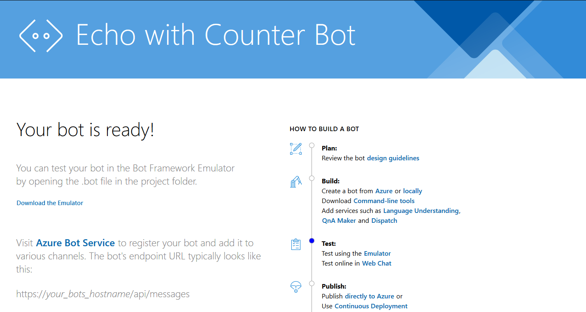
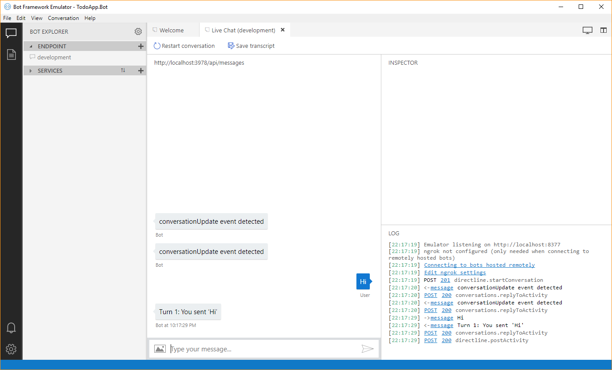

En este artículo vamos a desarrollar una pequeña aplicación tipo TO-DO list, muy sencilla, en ASP\.NET Core 2.1 con el Bot Builder v4, aplicando el proceso de desarrollo TDD.

## Introducción

La versión 4 del SDK Bot Builder, se reescribió por completo, aprovechando toda la experiencia de las versiones anteriores y tiene algunos cambios importantes de arquitectura, que están muy bien recopilados y explicados en el blog post [Bot Framework V4: What I learnt in 4 days in July 2018](https://blogs.msdn.microsoft.com/martinkearn/2018/07/17/bot-framework-v4-what-i-learnt-in-4-days-in-july-2018/) de [Martin Kearn](https://blogs.msdn.microsoft.com/martinkearn/), donde se pueden revisar en detalle con links a la documentación relevante.

La aplicación que vamos a desarrollar se puede usar luego para explorar paso a paso la nueva funcionalidad presentada en ese post.

Vamos a desarrollar la aplicación partiendo del tutorial del [EchoBot](https://docs.microsoft.com/azure/bot-service/dotnet/bot-builder-dotnet-sdk-quickstart?view=azure-bot-service-4.0).

## Conceptos de TDD

También vamos a aprovechar este artículo para hacer una breve introducción práctica al proceso de desarrollo con TDD, para quien no se haya animado todavía a trabajar así, y prefiera usar (perder) tiempo en el debugger 😉.

En forma muy resumida, el proceso es:

1. Desarrollar primero una prueba que verifique el funcionamiento de una característica y demostrar que la prueba falla. Esto es importante porque así "probamos la prueba".

2. Implementar la característica, con el código más sencillo posible, de forma que la prueba pase con éxito.

3. Refactorizar el código para mejorar claridad, mantenibilidad o reutilización, asegurando que todas las pruebas desarrolladas hasta el momento se completen con éxito.

4. Repetir hasta que se completen todas las características requeridas.

Además, es importante que las características se desarrollen progresivamente, comenzando con lo más sencillo posible y agregando en cada iteración solo un pequeño incremento de la funcionalidad.

Por eso, **para nuestro primer escenario de prueba**, **queremos que el bot salude al usuario por su nombre**, cuando éste le salude.

## Versiones utilizadas

- Visual Studio 2017 v15.8.4
- Microsoft.Bot.Builder.Core (4.0.1-preview)
- Microsoft.Bot.Builder.Core.Extensions (4.0.1-preview)
- Microsoft.Bot.Builder.Integration.AspNet.Core (4.0.1-preview)
- FluentAssertions (5.4.1)
- xunit (2.3.1)
- xunit.runner.visualstudio (2.3.1)

## Vista general de la aplicación TO-DO

La "aplicación" que vamos a desarrollar es muy sencilla con toda la intención y solo tendrá una entidad con tres propiedades: nombre, estatus y fecha límite.

La solución tendrá dos proyectos principales:

1. TodoApp: El back-end para manejar eventualmente la persistencia en una base de datos (en un artículo futuro).
2. TodoApp.Bot: La interfaz de usuario tipo Bot.

Esto facilitaría la extensión de nuestra aplicación para, eventualmente, incluir una `TodoApp.Mvc` o `TodoApp.Api` que trabajen sobre la misma base de datos.

## Proyecto TodoApp.Bot

Entonces vamos a comenzar por construir el bot, siguiendo el tutorial del EchoBot, pero con un par de ajustes:

1. Crear la carpeta `src`, tanto en la solución con en el filesystem y
2. Crear el proyecto como `TodoApp.Bot`

Notas:

- Puede ser conveniente [agregar un fichero `.editorconfig` al proyecto](https://docs.microsoft.com/visualstudio/ide/create-portable-custom-editor-options?view=vs-2017) para estandarizar algunos aspectos del código (como poner en indentado en espacios 😉).
- El proyecto se debe crear manualmente en la carpeta src del filesystem, además de crearlo en el solution folder src en VS.

También vamos a actualizar el `TargetFramework` a `netcoreapp2.1` en el fichero `TodoApp.Bot.csproj`:

```xml
<Project Sdk="Microsoft.NET.Sdk.Web">

  <PropertyGroup>
    <TargetFramework>netcoreapp2.1</TargetFramework>
```

También podemos encontrar que el fichero del proyecto hace referencia a este paquete, con número de versión:

```xml
    <PackageReference Include="Microsoft.AspNetCore.All" Version="2.0.7" />
```

Y, siguiendo las [recomendaciones para migrar a ASP.NET Core 2.1](https://docs.microsoft.com/aspnet/core/migration/20_21?view=aspnetcore-2.1), lo cambiamos a:

```xml
    <PackageReference Include="Microsoft.AspNetCore.App" />
```

Al final el fichero `TodoApp.Bot.csproj` debería quedar similar a esto:

```xml
<Project Sdk="Microsoft.NET.Sdk.Web">

  <PropertyGroup>
    <TargetFramework>netcoreapp2.1</TargetFramework>
    <CodeAnalysisRuleSet>EchoBotWithCounter.ruleset</CodeAnalysisRuleSet>
  </PropertyGroup>

  <ItemGroup>
    <Content Include="BotConfiguration.bot">
      <CopyToOutputDirectory>Always</CopyToOutputDirectory>
    </Content>
  </ItemGroup>

  <ItemGroup>
    <PackageReference Include="Microsoft.AspNetCore" Version="2.1.4" />
    <PackageReference Include="Microsoft.AspNetCore.App" />
    <PackageReference Include="AsyncUsageAnalyzers" Version="1.0.0-alpha003" PrivateAssets="all" />
    <PackageReference Include="Microsoft.Bot.Builder" Version="4.0.8" />
    <PackageReference Include="Microsoft.Bot.Builder.Integration.AspNet.Core" Version="4.0.8" />
    <PackageReference Include="Microsoft.Bot.Configuration" Version="4.0.8" />
    <PackageReference Include="Microsoft.Bot.Connector" Version="4.0.8" />
    <PackageReference Include="Microsoft.Bot.Schema" Version="4.0.8" />
    <PackageReference Include="Microsoft.Extensions.Logging.AzureAppServices" Version="2.1.1" />
    <PackageReference Include="StyleCop.Analyzers" Version="1.1.0-beta009" PrivateAssets="all" />
  </ItemGroup>

</Project>
```

Ahora ya podemos correr el programa con `Ctrl+F5` y deberíamos ver algo como esto:



Y al abrir el fichero `BotConfiguration.bot` con el [BotEmulator V4](https://github.com/Microsoft/BotFramework-Emulator), deberíamos ver algo como esto:



**Este es un buen momento para hacer commit** (aunque seguro que no hace falta recordarlo 😉).
